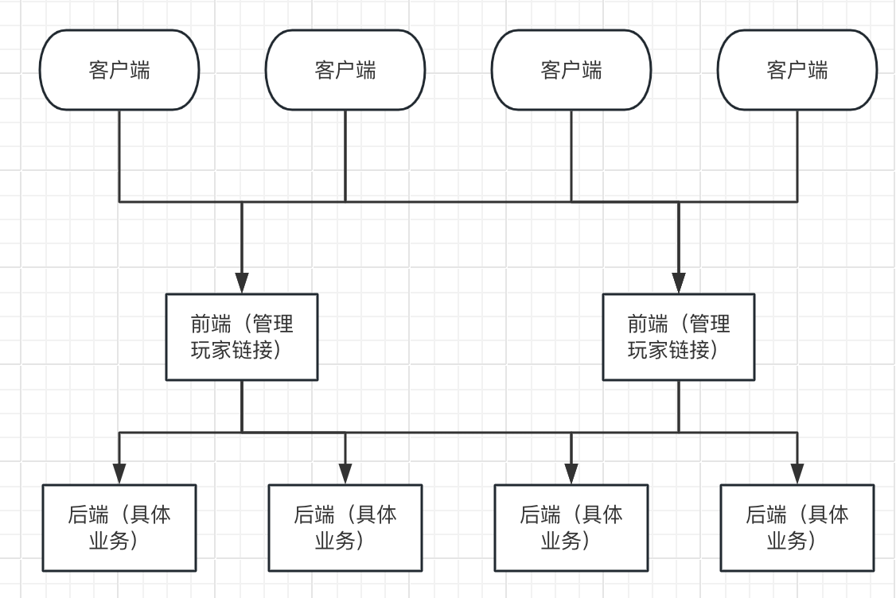

# zinx-cluster基于zinx的分布式扩展
zinx分布式扩展

## 前言

zinx是一款优秀的基于Golang轻量级并发服务器框架，但是框架不支持分布式，zinx-cluster基于zinx的分布式扩展

[github代码](https://github.com/timzzx/zinx-cluster)

## zinx-cluster设计

golang服务器分布式很多是基于rpc来实现的，但是在设计zinx-cluster时候，不想引入第三方来实现，想着完全使用zinx来实现。



基本思路就是上图所示，
+ 前端和后端都是zinx来实现的node节点，node分为前端和后端两种类型
+ 前端节点接收和管理客户端的链接
+ 前端根据msgID路由到指定的后端node来处理（也可以直接使用前端服务器来处理业务）
+ 后端也可以访问前端来访问其他后端node（这里其实也可以使用rpc来实现）

## zinx-cluster配置文件

配置文件设计如下
```json
// conf/dinx.json
{
    "gate": [ 
        { // 这是一个node的参数列表
         "ID": 1, // NodeId
         "Name": "gate-1", // Node 名称
         "Type": 1, // 类型 1.前端 2.后端
         "IP": "0.0.0.0", // Node 对外IP
         "Port": 10000 // Node 对外端口号
        }
    ],
    "im": [
        {"ID": 2, "Name": "im-1", "Type": 2, "IP": "0.0.0.0", "Port": 20000},
        {"ID": 3, "Name": "im-2", "Type": 2, "IP": "0.0.0.0", "Port": 21000}
    ]
}
// conf/roue.json
{
    "gate": [
        {"MsgID":1,"Name":"登录"}
    ],
    "im": [
        {"MsgID": 2, "Name": "发送"},
        {"MsgID": 3, "Name": "转发"}
    ]

}
```


基于配置文件先设计字典

ddict/dict.go
```go
package ddict

type RouteInfo struct {
	MsgID uint32 // 消息id
	Name  string // 路由名称
}
type RouteDict struct {
	MsgID     uint32 // 消息id
	Name      string // 路由名称
	GroupName GroupName
}
type NodeInfo struct {
	ID   int    // node id
	Name string // node 名称
	Type int    // node类型 1.gateway 2.backend
	IP   string // IP
	Port int    // 端口号
}

type NodeSlice = []*NodeInfo

type RouteSlice = []*RouteInfo

type GroupName = string

// node集合
type NodeGroupMap = map[GroupName]NodeSlice

// route集合
type RouteGroupMap = map[GroupName]RouteSlice
type RouteDicts = map[uint32]*RouteDict

// 字典
type Dict struct {
	NodeGroup  NodeGroupMap
	RouteGroup RouteGroupMap
}

func NewDict() *Dict {
	return &Dict{
		NodeGroup:  make(NodeGroupMap),
		RouteGroup: make(RouteGroupMap),
	}
}

// 增加node信息到字典中
func (d *Dict) AddNodeInfo(n GroupName, info *NodeInfo) {
	d.DelNodeInfo(n, info.ID)
	if value, ok := d.NodeGroup[n]; ok {
		d.NodeGroup[n] = append(value, info)
	} else {
		d.NodeGroup[n] = NodeSlice{info}
	}
}

// 增加router信息到字典中
func (d *Dict) AddRouteInfo(n GroupName, info *RouteInfo) {
	d.DelRouteInfo(n, info.MsgID)
	if value, ok := d.RouteGroup[n]; ok {
		d.RouteGroup[n] = append(value, info)
	} else {
		d.RouteGroup[n] = RouteSlice{info}
	}
}

// 删除字典中node信息
func (d *Dict) DelNodeInfo(n GroupName, NodeID int) {
	if value, ok := d.NodeGroup[n]; ok {
		j := 0
		for _, v := range value {
			if v.ID != NodeID {
				value[j] = v
				j++
			}
		}
		d.NodeGroup[n] = value[:j]
	}
}

// 删除字典中router信息
func (d *Dict) DelRouteInfo(n GroupName, MsgID uint32) {
	if value, ok := d.RouteGroup[n]; ok {
		j := 0
		for _, v := range value {
			if v.MsgID != MsgID {
				value[j] = v
				j++
			}
		}
		d.RouteGroup[n] = value[:j]
	}
}

// 展示node列表
func (d *Dict) NodeList() NodeGroupMap {
	return d.NodeGroup
}

// 展示Route列表
func (d *Dict) RouteList() RouteGroupMap {
	return d.RouteGroup
}

// Route字典
func (d *Dict) GetRouteDicts() RouteDicts {
	r := make(RouteDicts)

	for groupName, group := range d.RouteGroup {
		for _, v := range group {
			r[v.MsgID] = &RouteDict{
				MsgID:     v.MsgID,
				Name:      v.Name,
				GroupName: groupName,
			}
		}
	}
	return r
}

```
> 测试dict

ddict/dict_test.go 
```go
package ddict_test

import (
	"testing"

	"github.com/timzzx/zinx-cluster/ddict"
)

func TestAddNodeInfo(t *testing.T) {
	// 检查node是否添加成功
	d := ddict.NewDict()
	d.AddNodeInfo("test", &ddict.NodeInfo{
		ID:   1,
		Name: "test",
		Type: 1,
		IP:   "127.0.0.1",
		Port: 10000,
	})
	if len(d.NodeList()["test"]) != 1 {
		t.Fatal("node添加失败")
	}

	// 检查node是否重复添加
	d.AddNodeInfo("test", &ddict.NodeInfo{
		ID:   1,
		Name: "test",
		Type: 1,
		IP:   "127.0.0.1",
		Port: 10000,
	})
	if len(d.NodeList()["test"]) == 2 {
		t.Fatal("node重复添加")
	}
}

func TestAddRouteInfo(t *testing.T) {
	// 检查route是否添加成功
	d := ddict.NewDict()
	d.AddRouteInfo("test", &ddict.RouteInfo{
		MsgID: 1,
		Name:  "test",
	})
	if len(d.RouteList()["test"]) != 1 {
		t.Fatal("route添加失败")
	}

	// 检查route是否重复添加
	d.AddRouteInfo("test", &ddict.RouteInfo{
		MsgID: 1,
		Name:  "test",
	})
	if len(d.RouteList()["test"]) == 2 {
		t.Fatal("route重复添加")
	}
}

func TestGetRouteDicts(t *testing.T) {
	d := ddict.NewDict()
	d.AddRouteInfo("test", &ddict.RouteInfo{
		MsgID: 1,
		Name:  "test",
	})
	t.Log(d.GetRouteDicts())
	if d.GetRouteDicts()[1].MsgID != 1 {
		t.Fatal("路由字典获取失败")
	}
}

```
读取配置文件是参考zinx的配置文件读取设计
dconf/conf.go
```go
package conf

import (
	"encoding/json"
	"os"
	"path/filepath"

	"github.com/timzzx/zinx-cluster/ddict"
)

const (
	EnvDefaultConfigFilePath = "/conf/dinx.json"
	RouteFilePath            = "/conf/route.json"
)

var Dicts *ddict.Dict

func Reload(d *ddict.Dict) {
	// 配置
	pwd, err := os.Getwd()
	if err != nil {
		panic(err)
	}
	configFilePath := filepath.Join(pwd, EnvDefaultConfigFilePath)

	// 不存在配置文件直接退出
	if confFileExists, _ := PathExists(configFilePath); !confFileExists {
		return
	}

	// 读取配置文件
	data, err := os.ReadFile(configFilePath)
	if err != nil {
		panic(err)
	}

	err = json.Unmarshal(data, &d.NodeGroup)
	if err != nil {
		panic(err)
	}
	// 路由
	routeFilePath := filepath.Join(pwd, RouteFilePath)

	// 不存在路由直接退出
	if routeFileExists, _ := PathExists(routeFilePath); !routeFileExists {
		return
	}

	// 读取配置文件
	routeData, err := os.ReadFile(routeFilePath)
	if err != nil {
		panic(err)
	}

	err = json.Unmarshal(routeData, &d.RouteGroup)
	if err != nil {
		panic(err)
	}
}

// PathExists Check if a file exists.(判断一个文件是否存在)
func PathExists(path string) (bool, error) {
	_, err := os.Stat(path)
	if err == nil {
		return true, nil
	}
	if os.IsNotExist(err) {
		return false, nil
	}
	return false, err
}
func init() {
	Dicts = ddict.NewDict()
	// 默认增加gate配置
	Dicts.AddNodeInfo("gate", &ddict.NodeInfo{
		ID:   1,
		Name: "gate-1",
		Type: 1,
		IP:   "0.0.0.0",
		Port: 10000,
	})
	Reload(Dicts)
}

```
> 测试conf 

dconf/conf/dinx.json
```json
{
    "gate": [
        {"ID": 1, "Name": "gate-1", "Type": 1, "IP": "0.0.0.0", "Port": 10000}
    ],
    "im": [
        {"ID": 2, "Name": "im-1", "Type": 2, "IP": "0.0.0.0", "Port": 20000},
        {"ID": 3, "Name": "im-2", "Type": 2, "IP": "0.0.0.0", "Port": 21000}
    ]
}
```
dconf/conf_test.go
```go
package dconf

import (
	"testing"
)

func TestConf(t *testing.T) {
	if Dicts.NodeList()["im"][0].ID != 2 {
		t.Fatal("配置出错")
	}
}

```
## zinx-cluster 消息设计

dmessage/message.go
```go
package dmessage

import (
	"bytes"
	"encoding/gob"
)

// 内部消息封包解包
type NodeMessage struct {
	ConnID    uint64 // 链接ID
	NodeID    int    // nodeID
	NodeGroup string // Node组
	Data      []byte // 客户端消息data
}

func Encode(connID uint64, nodeID int, nodeGroup string, data []byte) ([]byte, error) {
	m := NodeMessage{
		ConnID:    connID,
		NodeID:    nodeID,
		NodeGroup: nodeGroup,
		Data:      data,
	}
	var buf bytes.Buffer
	encode := gob.NewEncoder(&buf)
	err := encode.Encode(m)

	return buf.Bytes(), err
}

func Decode(data []byte) (*NodeMessage, error) {
	m := &NodeMessage{}
	buf := bytes.NewBuffer(data)
	decode := gob.NewDecoder(buf)
	err := decode.Decode(m)
	return m, err
}

```
消息内部消息封包和解包使用的"encoding/gob"
> 测试message

dmessage/message_test.go
```go
package dmessage

import (
	"testing"

	"github.com/aceld/zinx/zpack"
)

func TestEncode(t *testing.T) {
	_, err := Encode(1, 1, "gate", []byte("test"))
	if err != nil {
		t.Error("解析错误:" + err.Error())
	}
}

func TestDecode(t *testing.T) {
	data, err := Encode(1, 1, "gate", []byte("test"))
	if err != nil {
		t.Error("解析错误:" + err.Error())
		return
	}
	m, err := Decode(data)
	if err != nil {
		t.Error("解析错误:" + err.Error())
		return
	}
	if m.ConnID != 1 {
		t.Error("解析错误: 数据不对")
		return
	}
}

func TestZinxMessageDecode(t *testing.T) {

	dp := zpack.NewDataPack()
	msg, _ := dp.Pack(zpack.NewMsgPackage(1, []byte("test")))
	_, err := Decode(msg)
	if err.Error() != "EOF" {
		t.Error("解析错误:" + err.Error())
		return
	}
}

```

## 外部客户端连接管理，内部客户端连接管理

> 这个连接管理基于zinx的connmanager修改而来

dmanager/connmanager.go
```go
package dmanager

// 内部链接管理
import (
	"errors"
	"strconv"

	"github.com/aceld/zinx/ziface"
	"github.com/aceld/zinx/zlog"
	"github.com/aceld/zinx/zutils"
)

type ConnManager struct {
	connections zutils.ShardLockMaps
}

func NewConnManager() *ConnManager {
	return &ConnManager{
		connections: zutils.NewShardLockMaps(),
	}
}

func (connMgr *ConnManager) Add(Id int, conn ziface.IConnection) {
	strConnId := strconv.Itoa(Id)
	connMgr.connections.Set(strConnId, conn) // 将conn连接添加到ConnManager中

	zlog.Ins().InfoF("connection add to ConnManager successfully: conn num = %d", connMgr.Len())
}

func (connMgr *ConnManager) Remove(Id int) {
	strConnId := strconv.Itoa(Id)
	connMgr.connections.Remove(strConnId) // 删除连接信息

	zlog.Ins().InfoF("connection Remove ConnID=%d successfully: conn num = %d", Id, connMgr.Len())
}

func (connMgr *ConnManager) Get(Id int) (ziface.IConnection, error) {

	strConnId := strconv.Itoa(Id)
	if conn, ok := connMgr.connections.Get(strConnId); ok {
		return conn.(ziface.IConnection), nil
	}

	return nil, errors.New("connection not found")
}

func (connMgr *ConnManager) Len() int {

	length := connMgr.connections.Count()

	return length
}

func (connMgr *ConnManager) ClearConn() {

	// Stop and delete all connection information
	for item := range connMgr.connections.IterBuffered() {
		val := item.Val
		if conn, ok := val.(ziface.IConnection); ok {
			// stop will eventually trigger the deletion of the connection,
			// no additional deletion is required
			conn.Stop()
		}
	}

	zlog.Ins().InfoF("Clear All Connections successfully: conn num = %d", connMgr.Len())
}

func (connMgr *ConnManager) GetAllConnID() []int {

	strConnIdList := connMgr.connections.Keys()
	ids := make([]int, 0, len(strConnIdList))

	for _, strId := range strConnIdList {
		connId, err := strconv.Atoi(strId)
		if err == nil {
			ids = append(ids, connId)
		} else {
			zlog.Ins().InfoF("GetAllConnID Id: %d, error: %v", connId, err)
		}
	}

	return ids
}

func (connMgr *ConnManager) GetAllConnIdStr() []string {
	return connMgr.connections.Keys()
}

```
dmanager/membermanager.go
```go
package dmanager

// 外部链接管理
import (
	"errors"
	"strconv"

	"github.com/aceld/zinx/ziface"
	"github.com/aceld/zinx/zlog"
	"github.com/aceld/zinx/zutils"
)

type MemberManager struct {
	connections zutils.ShardLockMaps
}

func NewMemberManager() *MemberManager {
	return &MemberManager{
		connections: zutils.NewShardLockMaps(),
	}
}

func (connMgr *MemberManager) Add(conn ziface.IConnection) {

	connMgr.connections.Set(conn.GetConnIdStr(), conn) // 将conn连接添加到ConnManager中

	zlog.Ins().InfoF("connection add to ConnManager successfully: conn num = %d", connMgr.Len())
}

func (connMgr *MemberManager) Remove(conn ziface.IConnection) {

	connMgr.connections.Remove(conn.GetConnIdStr()) // 删除连接信息

	zlog.Ins().InfoF("connection Remove ConnID=%d successfully: conn num = %d", conn.GetConnID(), connMgr.Len())
}

func (connMgr *MemberManager) Get(connID uint64) (ziface.IConnection, error) {

	strConnId := strconv.FormatUint(connID, 10)
	if conn, ok := connMgr.connections.Get(strConnId); ok {
		return conn.(ziface.IConnection), nil
	}

	return nil, errors.New("connection not found")
}

// Get2 It is recommended to use this method to obtain connection instances
func (connMgr *MemberManager) Get2(strConnId string) (ziface.IConnection, error) {

	if conn, ok := connMgr.connections.Get(strConnId); ok {
		return conn.(ziface.IConnection), nil
	}

	return nil, errors.New("connection not found")
}

func (connMgr *MemberManager) Len() int {

	length := connMgr.connections.Count()

	return length
}

func (connMgr *MemberManager) ClearConn() {

	// Stop and delete all connection information
	for item := range connMgr.connections.IterBuffered() {
		val := item.Val
		if conn, ok := val.(ziface.IConnection); ok {
			// stop will eventually trigger the deletion of the connection,
			// no additional deletion is required
			conn.Stop()
		}
	}

	zlog.Ins().InfoF("Clear All Connections successfully: conn num = %d", connMgr.Len())
}

func (connMgr *MemberManager) GetAllConnID() []uint64 {

	strConnIdList := connMgr.connections.Keys()
	ids := make([]uint64, 0, len(strConnIdList))

	for _, strId := range strConnIdList {
		connId, err := strconv.ParseUint(strId, 10, 64)
		if err == nil {
			ids = append(ids, connId)
		} else {
			zlog.Ins().InfoF("GetAllConnID Id: %d, error: %v", connId, err)
		}
	}

	return ids
}

func (connMgr *MemberManager) GetAllConnIdStr() []string {
	return connMgr.connections.Keys()
}

func (connMgr *MemberManager) Range(cb func(uint64, ziface.IConnection, interface{}) error, args interface{}) (err error) {

	connMgr.connections.IterCb(func(key string, v interface{}) {
		conn, _ := v.(ziface.IConnection)
		connId, _ := strconv.ParseUint(key, 10, 64)
		err = cb(connId, conn, args)
		if err != nil {
			zlog.Ins().InfoF("Range key: %v, v: %v, error: %v", key, v, err)
		}
	})

	return err
}

// Range2 It is recommended to use this method to 'Range'
func (connMgr *MemberManager) Range2(cb func(string, ziface.IConnection, interface{}) error, args interface{}) (err error) {

	connMgr.connections.IterCb(func(key string, v interface{}) {
		conn, _ := v.(ziface.IConnection)
		err = cb(conn.GetConnIdStr(), conn, args)
		if err != nil {
			zlog.Ins().InfoF("Range2 key: %v, v: %v, error: %v", key, v, err)
		}
	})

	return err
}

```

## 内部客户端实现

> 实现了一个内部的客户端，延迟初始化，前端服务器使用内部客户端访问后端服务器

dclient/client
```go
package dclient

import (
	"fmt"
	"math/rand"

	"github.com/aceld/zinx/zdecoder"
	"github.com/aceld/zinx/ziface"
	"github.com/aceld/zinx/znet"
	"github.com/timzzx/zinx-cluster/dconf"
	"github.com/timzzx/zinx-cluster/ddict"
	"github.com/timzzx/zinx-cluster/dmanager"
	"github.com/timzzx/zinx-cluster/dmessage"
)

var ClientConnManager *dmanager.ConnManager

func init() {
	ClientConnManager = dmanager.NewConnManager()
}

type ClientInterceptor struct {
}

func (m *ClientInterceptor) Intercept(chain ziface.IChain) ziface.IcResp {
	request := chain.Request() //从责任链中获取当前拦截器的输入数据
	// 这一层是自定义拦截器处理逻辑，这里只是简单打印输入
	iRequest := request.(ziface.IRequest) //注意：由于Zinx的Request类型，这里需要做一下断言转换

	deData, err := dmessage.Decode(iRequest.GetData())
	if err != nil {
		iRequest.Abort()
		return chain.Proceed(chain.Request()) //进入并执行下一个拦截器
	}
	if deData.NodeGroup != "" || deData.NodeID != 0 {
		// 内部消息转发
		// 获取连接
		client := Client(deData.NodeGroup, deData.NodeID)
		err = client.SendMsg(iRequest.GetMsgID(), iRequest.GetData())
		if err != nil {
			fmt.Println("发送数据错误")
			iRequest.Abort()
		}
	}

	return chain.Proceed(chain.Request()) //进入并执行下一个拦截器

}

// client
func Client(group ddict.GroupName, NodeId int) ziface.IConnection {
	// 获取随机配置 TODO：可以扩展，不同的负载均衡的方式
	l := dconf.Dicts.NodeList()[group]
	n := rand.Intn(len(l))
	var c *ddict.NodeInfo
	for _, v := range l {
		if v.ID == NodeId {
			c = v
		}
	}
	// 获取配置
	if c == nil {
		c = l[n]
	}

	conn, _ := ClientConnManager.Get(c.ID)
	if conn != nil {
		return conn
	}
	// 启动client
	connChannl := make(chan ziface.IConnection, 1)
	go clientSatrt(c.IP, c.Port, connChannl)
	ClientConnManager.Add(c.ID, <-connChannl)
	conn, _ = ClientConnManager.Get(c.ID)
	return conn
}

func clientSatrt(ip string, port int, connChannl chan ziface.IConnection) ziface.IConnection {
	// 启动client
	client := znet.NewClient(ip, port)
	client.SetOnConnStart(func(i ziface.IConnection) {
		connChannl <- i
	})
	// client.StartHeartBeat(3 * time.Second)
	client.AddInterceptor(&zdecoder.TLVDecoder{})
	client.AddInterceptor(&ClientInterceptor{})
	client.SetDecoder(nil)
	client.Start()
	select {}
}

```

## Node服务设计

> Node只要设计好前端Node服务的拦截器，来处理玩家的消息

先设置member和client的链接的全局管理，这里需要修改client （避免client和node循环调用）

dmanager/connection.go
```go
package dmanager

// var MemberConnManager *dmanager.MemberManager
var ClientConnManager *ConnManager
var MemberConnManager *MemberManager

func init() {
	MemberConnManager = NewMemberManager()
	ClientConnManager = NewConnManager()
}

```

修改dclient/client 把下面代码删除
```go
...
// var ClientConnManager *dmanager.ConnManager

// func init() {
// 	ClientConnManager = dmanager.NewConnManager()
// }
...

conn, _ := dmanager.ClientConnManager.Get(c.ID) // 修改
if conn != nil {
    return conn
}
// 启动client
connChannl := make(chan ziface.IConnection, 1)
go clientSatrt(c.IP, c.Port, connChannl)
dmanager.ClientConnManager.Add(c.ID, <-connChannl) // 修改
conn, _ = dmanager.ClientConnManager.Get(c.ID) // 修改
return conn

```


dnode/node.go
```go
package dnode

import (
	"fmt"

	"github.com/aceld/zinx/ziface"
	"github.com/timzzx/zinx-cluster/dclient"
	"github.com/timzzx/zinx-cluster/dconf"
	"github.com/timzzx/zinx-cluster/ddict"
	"github.com/timzzx/zinx-cluster/dmanager"
	"github.com/timzzx/zinx-cluster/dmessage"
)

type NodeInterceptor struct {
	Node      *ddict.NodeInfo
	GroupName string
}

func (m *NodeInterceptor) Intercept(chain ziface.IChain) ziface.IcResp {
	request := chain.Request() //从责任链中获取当前拦截器的输入数据

	// 这一层是自定义拦截器处理逻辑，这里只是简单打印输入
	iRequest := request.(ziface.IRequest) //注意：由于Zinx的Request类型，这里需要做一下断言转换

	// 保存用户coon
	dmanager.MemberConnManager.Add(iRequest.GetConnection())
	// 消息封包
	data, err := dmessage.Encode(iRequest.GetConnection().GetConnID(), 0, "", iRequest.GetData())
	// 消息转发
	d := dconf.Dicts.GetRouteDicts()
	if r, ok := d[iRequest.GetMsgID()]; ok {
		// 判断是否为当前gate数据
		if r.GroupName != m.GroupName {
			// 获取连接
			c := dclient.Client(r.GroupName, 0)
			if err != nil {
				fmt.Println("封包错误")
				iRequest.Abort()
			}
			err = c.SendMsg(iRequest.GetMsgID(), data)
			if err != nil {
				fmt.Println("发送数据错误")
				iRequest.Abort()
			}
		}
	}
	iRequest.GetMessage().SetData(data)
	iRequest.GetMessage().SetDataLen(uint32(len(data)))
	return chain.Proceed(chain.Request()) //进入并执行下一个拦截器
}

```

前端Node处理玩家消息和内部Client消息转发功能都好了，但是还需要处理内部client收到发送给用户的消息

修改Client

dclient/client.go

```go
// 增加下面的else部分
if deData.NodeGroup != "" || deData.NodeID != 0 {
    // 内部消息转发
    // 获取连接
    client := Client(deData.NodeGroup, deData.NodeID)
    err = client.SendMsg(iRequest.GetMsgID(), iRequest.GetData())
    if err != nil {
        fmt.Println("发送数据错误")
        iRequest.Abort()
    }
} else { 
    //发送给玩家
    c, err := dmanager.MemberConnManager.Get(deData.ConnID)
    if err != nil {
        fmt.Println("玩家链接获取失败：", err.Error())
    }
    err = c.SendMsg(iRequest.GetMsgID(), deData.Data)

    if err != nil {
        fmt.Println("发送数据错误")
        iRequest.Abort()
    }
}
```

## zinx-cluster Demo
项目目录
```shell
demo
|____gate # 前端server
| |____gate.go
| |____conf # zinx配置
| | |____zinx.json
| |____handlers # gate业务代码
| | |____login.go
|____im # 后端server
| |____im.go
| |____conf # zinx配置
| | |____zinx.json
| |____handlers # im业务代码
| | |____sned.go
|____conf # zinx-cluster配置
| |____dinx.json
| |____route.json
|____client # 客户端
| |____main.go
|____main.go # 主入口
```


[github代码](https://github.com/timzzx/zinx-cluster/demo)

```shell
# 服务器启动
cd demo
go run main.go

# 客户端
cd demo/client
go run main.go # 修改消息id发送即可

# msg 1
# 服务器输出
服务器名称: gate-1
接收消息id: 1

# msg 2
# 服务器输出
服务器名称: im-1
接收消息id: 2
# 客户端
2024/03/30 21:08:41 [DEBUG]main.go:39: recv from server : msgId= 2 , data= Pong...Pong...Pong...

# msg 3 转发
# 服务器输出
2024/03/30 21:10:40 [ERROR]msghandler.go:261: api msgID = 3 is not FOUND!
服务器名称: im-2
接收消息id: 3
2024/03/30 21:10:40 [ERROR]msghandler.go:261: api msgID = 2 is not FOUND!
服务器名称: im-1
接收消息id: 2
2024/03/30 21:10:40 [ERROR]msghandler.go:261: api msgID = 2 is not FOUND!
# 客户端
2024/03/30 21:10:40 [DEBUG]main.go:39: recv from server : msgId= 2 , data= Pong...Pong...Pong...
```


## 小结

实现的功能
+ 前端服务器转发到后端服务器
+ 前端服务器可以直接处理handler，后端和前端的区别就是后端只能通过前端来和客户端通信
+ 后端可以通过消息NodeID NodeGroup来访问其他node。（类似RPC，Node不是直连，而是通过前端Node来相互通信）

现在我设置的是一个前端服务器，用户链接在一个服务器中，所以相互通信通过前端服务器就能实现，不过如果多个前端服务器，就需要一个redis，mysql之类的数据库来管理所有用户连接信息。

问题
+ 没有经过大量的测试，只是实现了功能设计
+ 在使用zinx的数据拦截，发现无法在拦截器直接停止，abort有一些问题，（也可能是我没有用好），这样会导致前端的拦截器和内部客户端拦截器转发之后会在自身寻找对应的msgId来处理消息，对应的msgId在其自身是不存在的，所以会报错，暂时还没找到好的处理方式


后续会使用zinx-cluster开发一些具体的项目来展示具体功能